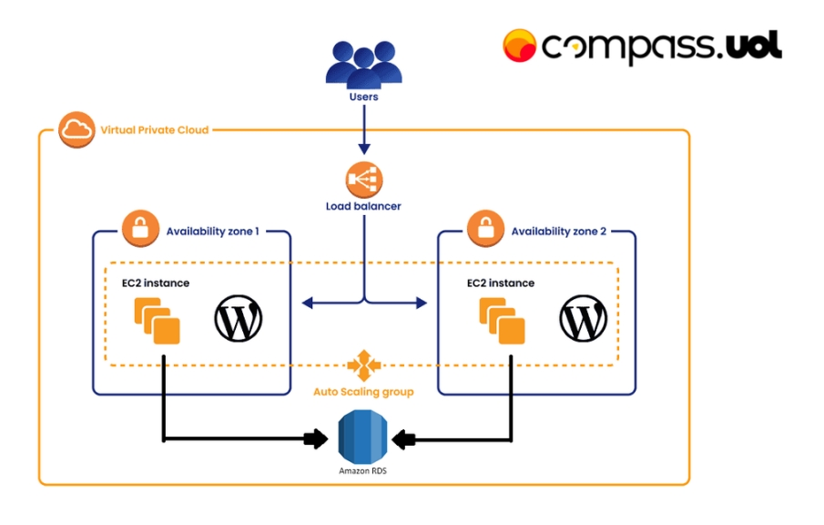
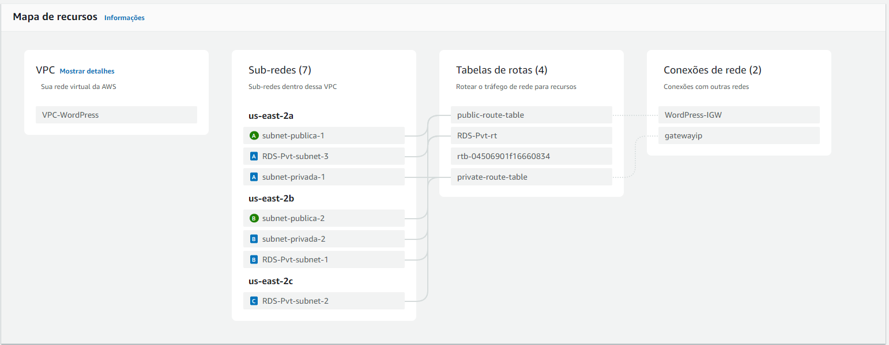

# Projeto Compass - Atividade AWS para instalação do Wordpress pela EC2

<p align="center">
  
</p>

🛠️ Atividade: Configuração e Implementação no AWS
Objetivo
Configurar o ambiente na AWS utilizando Docker/Container na instância EC2 e realizar o Deploy da aplicação WordPress, integrando banco de dados MySQL via RDS, armazenamento de arquivos estáticos com Amazon EFS e balanceamento de carga com AWS Load Balancer.

<p align="center">
  
</p>

## 📜 **Conteúdo**

1. [Security Groups](#security-groups)  
2. [VPC - Virtual Private Cloud](#vpc---virtual-private-cloud)  
3. [EFS - Elastic File System](#efs---elastic-file-system)  
4. [RDS - Relational Database](#rds---relational-database)  
5. [Instância EC2 e User Data](#instância-ec2-e-user-data)  
6. [Acesso ao EC2 e Bastion Host](#acesso-ao-ec2-e-bastion-host)  
7. [Load Balancer](#load-balancer)  
8. [ASG - Auto Scaling Group](#asg---auto-scaling-group)  
9. [Conclusão](#conclusão)


### 1️⃣ 🔐[Security Groups - Criação](#security-groups)
Antes de iniciarmos a criação da EC2, do RDS e do EFS, devemos criar os Security Groups para cada um no console AWS.

+ O SG da EC2 deve conter as seguintes Inbound Rules:

  | Type         | Protocol | Port Range | Source Type | Source          |
  |--------------|----------|------------|-------------|-----------------|
  | HTTP         | TCP      | 80         | Anywhere    | SG Load Balancer|
  | SSH          | TCP      | 80         | Anywhere    | 10.0.0.x        |


##

+ O SG do RDS deve conter a seguinte Inbound Rule:

  | Type         | Protocol | Port Range | Source Type | Source          |
  |--------------|----------|------------|-------------|-----------------|
  | MYSQL/Aurora | TCP      | 3306       | Anywhere    | SG para o EC2   |


##

+ O SG do EFS deve conter a seguinte Inbound Rule:

  | Type         | Protocol | Port Range | Source Type | Source       |
  |--------------|----------|------------|-------------|--------------|
  | NFS          | TCP      | 2049       | Anywhere    | SG para o EC2|

##

+ O SG do Load Balancer deve conter a seguinte Inbound Rule:

  | Type             | Protocol | Port Range | Source Type | Source       |
  |------------------|----------|------------|-------------|--------------|
  | HTTP             | TCP      | 80         | Anywhere    | 0.0.0.0/0    |
  | TCP Personalizado| TCP      | 8080       | Anywhere    | 0.0.0.0/0    |

---

### 2️⃣ ☁️[VPC - Virtual Private Cloud](#vpc---virtual-private-cloud)  
Configurar a rede virtual privada para gerenciar recursos de forma segura.  
<p align="center">
  
</p>

Mapa de recursos em uma VPC (Virtual Private Cloud) configurada no AWS. A VPC "VPC-WordPress" possui sub-redes públicas e privadas espalhadas por diferentes zonas de disponibilidade (us-east-2a, us-east-2b e us-east-2c).

As tabelas de rotas controlam o tráfego da rede, conectando sub-redes a recursos externos por meio de um Internet Gateway (WordPress-IGW) e um Gateway de IP. Sub-redes privadas são associadas a tabelas de rotas específicas, como as privadas e do RDS, garantindo isolamento e segurança para bancos de dados.

---

### 3️⃣ 📂[EFS - Elastic File System](#efs---elastic-file-system)  

Configurar o sistema de arquivos compartilhado utilizando o serviço Amazon Elastic File System.  

## Passos para Criar e Configurar o EFS

1. **Acesse o Console do AWS**  
   Navegue até o serviço Amazon EFS.

2. **Criação do Sistema de Arquivos**  
   - Clique em **Criar sistema de arquivos**.
   - Escolha a VPC onde o EFS será criado.
   - Configure as sub-redes e os grupos de segurança associados.

3. **Configuração de Sub-redes**  
   - Certifique-se de que o EFS esteja associado a sub-redes em todas as zonas de disponibilidade necessárias.
   - Configure os *mount targets* em cada sub-rede.

4. **Definição de Permissões**  
   - Configure o grupo de segurança para permitir acesso ao EFS via NFS (porta 2049).
   - Ajuste as permissões conforme necessário para instâncias EC2 ou outros serviços.

5. **Montagem do EFS em Instâncias EC2**  
   - Instale o cliente NFS na instância EC2:  
     ```bash
     sudo yum install -y nfs-utils
     ```
   - Monte o EFS na instância com o comando:  
     ```bash
     sudo mount -t nfs4 <ID-do-EFS>.efs.<região>.amazonaws.com:/ <ponto-de-montagem>
     ```

6. **Configuração Automática (Opcional)**  
   Adicione a entrada no arquivo `/etc/fstab` para montagem automática após reinicializações:
   ```fstab
   <ID-do-EFS>.efs.<região>.amazonaws.com:/ <ponto-de-montagem> nfs4 defaults,_netdev 0 0

---

### 4️⃣ 🎲[RDS - Relational Database](#rds---relational-database) 

## Passos para Criar e Configurar o RDS

1. **Acesse o Console do AWS**  
   - Navegue até o serviço **Amazon RDS**.

2. **Criação da Instância**  
   - Clique em **Criar banco de dados**.
   - Escolha o método de criação: **Padrão** ou **Rápido**.
   - Selecione o mecanismo de banco de dados (MySql)
   - Configure os detalhes básicos, como:
     - Versão do mecanismo.
     - Tipo de instância (ex.: db.t2.micro).
     - Configurações de armazenamento (SSD, tamanho inicial, etc.).

3. **Configurações de Rede e Segurança**  
   - Escolha a VPC associada a sua instância privada.
   - Selecione a SG RDS.

4. **Autenticação e Acesso**  
   - Configure as credenciais de administrador do banco (usuário e senha).

5. **Finalização e Criação**  
   - Revise todas as configurações.
   - Clique em **Criar banco de dados**. A criação pode levar alguns minutos.

6. **Conexão ao Banco de Dados**  
   - Obtenha o endpoint do banco de dados no console RDS.
   - Use uma ferramenta de cliente SQL (como MySQL Workbench ou psql) ou configure uma aplicação para se conectar ao banco:
     ```bash
     mysql -h <endpoint-do-rds> -P 3306 -u <usuário> -p
     ```

7. **Configuração de Backups e Monitoramento**  
   - Configure snapshots automáticos para backups.
   - Monitore o desempenho via Amazon CloudWatch.

## Notas Importantes
- Certifique-se de configurar o RDS para estar em uma sub-rede privada, caso não seja necessário acesso público.
- Utilize políticas IAM para gerenciar permissões de usuários.
- Ative Multi-AZ Deployment para alta disponibilidade, se necessário.

Para mais detalhes, consulte a [documentação oficial do AWS RDS](https://docs.aws.amazon.com/rds/latest/UserGuide/Welcome.html).

---

### 5️⃣ 🗝️[Instância EC2 e User Data](#instância-ec2-e-user-data)

## Passos para Configurar a EC2

1. **Acesse o Console do AWS**  
   - Navegue até o serviço **Amazon EC2**.

2. **Criação da Instância**  
   - Clique em **Executar instâncias**.
   - Selecione uma AMI (Amazon Machine Image) adequada, como Amazon Linux 2 ou Ubuntu.
   - Escolha o tipo de instância (ex.: t2.micro para Free Tier).

3. **Configurações de Rede**  
   - Escolha uma VPC criada para a instância privada.
   - Selecione a SG Ec2.

4. **User Data para Automação**  
   - No campo **User Data**, insira um script para executar tarefas automaticamente no início, como:
     ```#!/bin/bash
        sudo yum update -y
        sudo yum install docker -y
        sudo systemctl start docker
        sudo systemctl enable docker
        sudo usermod -aG docker ec2-user
        sudo chkconfig docker on
        sudo curl -L "https://github.com/docker/compose/releases/latest/download/docker-compose-$(uname -s)-$(uname -m)" -o /usr/local/bin/docker-compose
        sudo chmod +x /usr/local/bin/docker-compose
        sudo mv /usr/local/bin/docker-compose /bin/docker-compose
        sudo yum install nfs-utils -y
        sudo mkdir /mnt/efs/
        sudo chmod +rwx /mnt/efs/
     ```

Esse shellscript (user_data.sh) nos auxiliará em:

Atualização do sistema operacional

Instalação do Docker e do Docker Compose

Configuração de permissões

Preparação do ambiente para trabalhar com um sistema de arquivos NFS que armazenará os arquivos do WordPress

Com todos esses passos feitos, basta criar sua instância EC2.

5. **Configurações de Armazenamento**  
   - Configure o volume de armazenamento com o tamanho necessário e, se preferir, criptografia.

6. **Lançamento da Instância**  
   - Revise todas as configurações e clique em 
   **Executar instância**.
   - Baixe ou selecione uma chave SSH para acessar a instância.

## Notas Importantes
- Garanta que o User Data seja compatível com o sistema operacional da AMI escolhida.
- Para segurança, restrinja o acesso por IP ao grupo de segurança.
- Utilize IAM Roles para permitir que a instância EC2 acesse outros serviços AWS.

Para mais informações, consulte a [documentação oficial da Amazon EC2](https://docs.aws.amazon.com/ec2/index.html).  

---

### 6️⃣ 🔓[Acesso ao EC2 e Bastion Host](#acesso-ao-ec2-e-bastion-host)

## Configuração de um Bastion Host

O Bastion Host atua como uma ponte para acessar instâncias em sub-redes privadas.

1. **Criação do Bastion Host**  
   - Crie uma instância EC2 em uma sub-rede **pública** com acesso à Internet.
   - Configure o grupo de segurança para:
     - Permitir conexões SSH (porta 22) somente do IP do administrador.

2. **Configuração de Acesso à Rede Privada**  
   - Garanta que o Bastion Host tenha permissões de acesso às instâncias privadas dentro da VPC.

## Transferindo a Chave SSH para o Bastion Host

Para acessar instâncias privadas a partir do Bastion Host, você precisará transferir sua chave SSH para ele. Aqui estão as etapas e comandos:

1. **Certifique-se de ter a chave privada no Windows**  
   Localize sua chave SSH (exemplo: `chave-privada.pem`) no Windows.

2. **Instale o PuTTY ou Use o Cliente SSH do Windows**  
   No Windows 10 ou superior, você pode usar o cliente SSH diretamente pelo terminal PowerShell ou Prompt de Comando.

3. **Copie a Chave para o Bastion Host**  
   Use o seguinte comando no terminal para transferir sua chave SSH para o Bastion Host:
   ```bash
   scp -i caminho-para-chave-bastion.pem caminho-para-chave-privada.pem ec2-user@<IP-Bastion>:/home/ec2-user/
---

## Notas de Segurança
- **Use IAM Roles:** Não salve chaves privadas nas instâncias.
- **Auditoria e Logs:** Ative logs do CloudTrail para monitorar conexões SSH.
- **Multi-Factor Authentication:** Configure MFA para maior segurança ao acessar o Bastion Host.

Para mais detalhes, consulte a [documentação oficial da AWS](https://docs.aws.amazon.com/).

---

### 7️⃣ ⚖️[Load Balancer](#load-balancer)  
## Configuração do Load Balancer (ELB)

Siga as etapas abaixo para criar e configurar um Load Balancer na AWS:

1. **Criação do Load Balancer**  
   - Acesse o console do AWS Elastic Load Balancer.
   - Escolha a opção **Application Load Balancer** (para HTTP/HTTPS) ou outro tipo conforme necessário.
   - Defina o nome do Load Balancer e selecione a VPC e sub-redes públicas.

2. **Configuração do Listeners**  
   - Adicione um listener para as portas HTTP (80) e/ou HTTPS (443).
   - Para HTTPS, configure o certificado SSL usando o AWS Certificate Manager (ACM).

3. **Definição dos Grupos de Alvo (Target Groups)**  
   - Crie um grupo de alvos (Target Group) e configure-o com:
     - Tipo: **Instance** ou **IP**.
     - Porta de destino, como **80**.
     - Protocolo: **HTTP**.
   - Adicione as instâncias EC2 ao grupo.

4. **Associação entre o Load Balancer e o Target Group**  
   - Conecte o listener do Load Balancer ao grupo de alvos criado.
   - Configure regras de roteamento, se necessário.

5. **Testes de Saúde (Health Checks)**  
   - No grupo de alvos, configure os testes de saúde:
     - Protocolo: HTTP.
     - Caminho: `/` ou outro endpoint de saúde.

6. **Configuração de Segurança**  
   - Edite o grupo de segurança (Security Group) do Load Balancer para permitir tráfego nas portas **80** e **443**.
   - Verifique se o Security Group das instâncias EC2 permite tráfego do Load Balancer.

7. **Testando o Load Balancer**  
   - Acesse o DNS do Load Balancer (fornecido pela AWS) no navegador para confirmar que ele está distribuindo o tráfego corretamente.

---

Para mais informações, consulte a [documentação oficial do AWS Elastic Load Balancer](https://docs.aws.amazon.com/elasticloadbalancing/latest/userguide/).
  

---

### 8️⃣ 🖨️[ASG - Auto Scaling Group](#asg---auto-scaling-group)   
## Configuração do Auto Scaling Group (ASG)

Siga os passos abaixo para criar e configurar um Auto Scaling Group na AWS:

1. **Criação do Launch Template**  
   - No console da AWS, acesse **EC2** > **Launch Templates** e clique em **Create Launch Template**.
   - Defina o nome do template e configure:
     - Tipo de instância (exemplo: `t2.micro`).
     - AMI (Amazon Machine Image).
     - Par de chaves (Key Pair) para acesso SSH.
     - Use o seu user_data.sh.

2. **Criação do Auto Scaling Group**  
   - No console da AWS, acesse **Auto Scaling Groups** e clique em **Create Auto Scaling Group**.
   - Associe o Launch Template criado anteriormente.
   - Escolha a VPC e sub-redes para o ASG.

3. **Definição de Políticas de Escalabilidade**  
   - Configure as opções de capacidade mínima, desejada e máxima:
     - Capacidade mínima: número mínimo de instâncias que sempre estarão rodando.
     - Capacidade máxima: número máximo de instâncias permitidas.
   - Adicione uma política de escalabilidade:
     - **Escalabilidade baseada em métricas**: Utilize métricas do CloudWatch, como CPU Utilization.
     - **Escalabilidade preditiva**: Defina horários específicos.

4. **Configuração de Health Checks**  
   - Configure os Health Checks para verificar a integridade das instâncias:
     - Tipo de Health Check: EC2 ou Elastic Load Balancer (ELB), se houver.

5. **Configuração de Alvos (Targets)**  
   - Associe o Auto Scaling Group ao Load Balancer, se configurado.
   - Certifique-se de que as instâncias EC2 no ASG estão associadas ao grupo de alvos correto (Target Group).

6. **Testando o ASG**  
   - Reduza ou aumente manualmente a capacidade desejada para testar se o ASG está adicionando/removendo instâncias conforme esperado.

---

Para mais informações, consulte a [documentação oficial do AWS Auto Scaling](https://docs.aws.amazon.com/autoscaling/latest/userguide/).
  

---

## 🏆 [**Conclusão**](#conclusão)  
Após a implementação das configurações e serviços, seu ambiente estará preparado com alta disponibilidade, banco de dados configurado, armazenamento estático com EFS e balanceamento de carga através do Load Balancer.  
